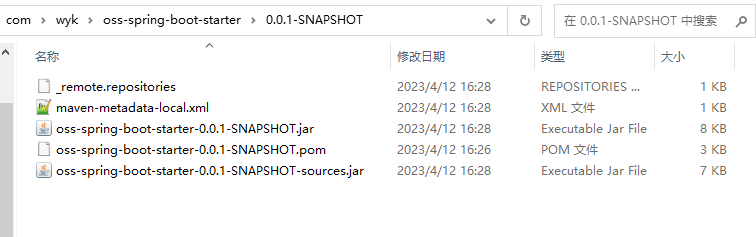

## Starter介绍
企业级OSS对象存储服务Spring Boot Starter制作，开箱即用，为项目进行赋能。
基于AmazonS3协议，适配市面上的对象存储服务如：阿里云OSS、腾讯COS、七牛云OSS、MInio等等。

## 什么是OSS？
OSS（Object Storage Service），对象存储服务，对象存储服务是一种使用HTTP API存储和检索对象的工具。
就是将系统所要用的文件上传到云硬盘上，该云硬盘提供了文件下载、上传、预览等一系列服务，具备版本，权限控制能力，具备数据生命周期管理能力这样的服务以及技术可以统称为OSS。
- 一般项目使用OSS对象存储服务，主要是对图片、文件、音频等对象集中式管理权限控制，管理数据生命周期等等，提供上传，下载，预览，删除等功能。
- 通过OSS部署前端项目。
## 什么是AmazonS3?
`Amazon Simple Storage Service（Amazon S3，Amazon简便存储服务）`是 AWS 最早推出的云服务之一，经过多年的发展，S3 协议在对象存储行业事实上已经成为标准。
- 提供了统一的接口 REST/SOAP 来统一访问任何数据
- 对 S3 来说，存在里面的数据就是对象名（键），和数据（值）
- 不限量，单个文件最高可达 5TB，可动态扩容。
- 高速。每个 bucket 下每秒可达 3500 PUT/COPY/POST/DELETE 或 5500 GET/HEAD 请求。
- 具备版本，权限控制能力
- 具备数据生命周期管理能力

作为一个对象存储服务，S3 功能真的很完备，行业的标杆，目前市面上大部分OSS对象存储服务都支持AmazonS3，
如`阿里云OSS`、`七牛云对象存储`、`腾讯云COS`、`开源对象存储MinIO`，都兼容S3协议。
本项目基于AmazonS3 协议封装Spring Boot Starter，若项目中使用阿里云OSS、腾讯云COS、七牛云对象存储等，可直接引入本项目的starter，
配置云服务商提供的endpoint、accessKey、secretKey就可开箱即用。

## 项目中引入`oss-spring-boot-starter`
### 1.下载项目以后，install到本地仓库，本地仓库中可看到install成功的jar包：



### 2.项目中引入maven坐标
```maven
         <dependency>
             <groupId>com.wyk</groupId>
             <artifactId>oss-spring-boot-starter</artifactId>
             <version>0.0.1-SNAPSHOT</version>
         </dependency>
```

### 3.配置云服务商提供的对象存储配置
如下使用MinIO进行演示：
```properties
oss.endpoint=http://127.0.0.1:9000
oss.accessKey=minioadmin
oss.secretKey=minioadmin
oss.maxConnections=10
```

### 3.使用api
如下为各个api的测试，首先注入OssTemplate Bean:
```java
    @Resource
    private OssTemplate ossTemplate;
```

- 创建bucket
```java
    @Test
    public void createBucket() {
        ossTemplate.createBucket("oss01");
    }
```
- 列出所有bucket
```java
    @Test
    public void listAllBucket() {
        List<Bucket> bucketList = ossTemplate.getAllBuckets();
        bucketList.forEach(bucket -> System.out.println(bucket.toString()));
    }
```

- 上传文件
```java
    @Test
    public void putObject01() throws Exception {
        File file = new File("D:\\test.xlsx");
        FileInputStream fileInputStream = new FileInputStream(file);
        ossTemplate.putObject("oss01", file.getName(), fileInputStream);
    }

    @Test
    public void putObject02() throws Exception {
        File file = new File("D:\\test.xlsx");
        FileInputStream fileInputStream = new FileInputStream(file);
        ossTemplate.putObject("oss01", file.getName(), fileInputStream, "xlsx");
    }
```
- 下载文件
```java
    @Test
    public void getObject() throws IOException {
        File file = new File("D:\\test.xlsx");
        S3Object s3Object = ossTemplate.getObject("oss01", file.getName());
        IOUtils.copy(s3Object.getObjectContent(), new FileOutputStream("D:\\test_copy.xlsx"));
    }
```
- 获取对象的URL
```java
    @Test
    public void getObjectURL() {
        String url = ossTemplate.getObjectURL("oss01", "test.xlsx", 1);
        System.out.println(url);
    }
```

- 删除对象
```java
    @Test
    public void removeObject() throws Exception {
        ossTemplate.removeObject("oss01", "test.xlsx");
    }
```

- 根据文件名前缀获取所有对象
```java
    @Test
    public void getAllObjectsByPrefix() {
        List<S3ObjectSummary> list = ossTemplate.getAllObjectsByPrefix("oss01", "test", false);
        list.forEach(s3ObjectSummary -> System.out.println(s3ObjectSummary.toString()));
    }
```